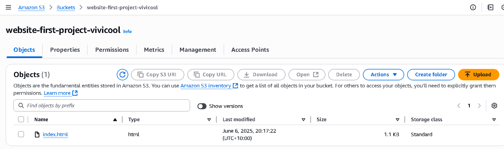

# Host a website on Amazon S3

### Project goal:

Host static website using Amazon S3 and learn how AWS stores files (objects - like files, imgs, etc) and delivers them publicly through a web endpoint.

### Diagram of Host a website


### Tools and Concepts

I used **Amazon S3** to host a static website. I learned how to:

- Upload static website files like `index.html` and folders
- Use the **bucket endpoint URL** to access the site
- Control file access using **ACLs**
- Configure **public access settings** for hosting
- Use **bucket policies** to block unwanted actions (like delete)

---

### Step-by-Step Instructions

**Before start project, always check region:**

> Pick the region closest to you.
>
> It's best practice to pick the nearest region—it helps your site load faster and lower costs.
>
> Your objects will stored in that region.

### 1. Create an S3 Bucket

- S3 console, **create bucket** name — ensure globally unique
- Click **enable ACLs** (optional, I enabled to learn of access controls)

**Notes:**

> Bucket names must be globally unique. Even if you're in a different region or account ID, you can’t reuse a name that someone else has already taken.

### 2. Set Permissions (Public Access Settings on bucket)

**Public Access Settings**

- By default, S3 blocks all public access.
- To host a public website, **uncheck** “Block all public access.”
- If left checked box, files will remain private and the site won’t load.

> **What Are ACLs (Access Control Lists)?**
> ACLs let you set who can access files inside the bucket.
> I enabled ACLs to manage access for learning purposes.
> AWS recommends to disabled, but I kept “enabled” to compare with bucket policies.

### 3. Bucket Versioning

- Tick **Enable** to keeping update
- Finally click “Create Bucket”


### 4. Upload Website Files to our bucket

- Go to your bucket → **Upload** → Add `index.html` and folders
- Wait for the upload to finish, then close the upload dialog


Folder now inside bucket



### 5. Enable Static Website Hosting

- Go to **Properties** tab of the bucket
- Scroll to **Static website hosting** → Click **Edit**
- Configure the following settings:
  - **Static web hosting:** Choose **`Enable`**.
  - **Hosting type:** Choose **`Host a static website`**.
  - **Index document:** Enter `index.html`
- click "save changes”
- Click **URL endpoint** to open

### 6. Fix the 403 Forbidden Error

Once you open URL endpoint. Still access denied, your files are still private.


Fix:

- Go to **Objects** tab
- Select your files (e.g., `index.html`, folders)
- Click **Actions** → **Make public using ACL**
- Refresh your S3 endpoint URL – the website should now display


> got wrong folders or files? you can delete and reupload.

---

## Bucket Policy to Block Delete Actions

To prevent accidental or unwanted deletion of files, you can apply this policy:

```json
{
  "Version": "2012-10-17",
  "Id": "MyBucketPolicy",
  "Statement": [
    {
      "Sid": "BucketPutDelete",
      "Effect": "Deny",
      "Principal": "*",
      "Action": "s3:DeleteObject",
      "Resource": "arn:aws:s3:::<your-bucket-name>/<your-bucket-name>"
    }
  ]
}
```

**What it does:**

- Denies the `s3:DeleteObject` action
- Applies to all users (`Principal: "*"`)
- Protects all objects in your bucket

**How to delete policies:**

- Delete this policy if you want to remove S3 bucket.

---

## What I Learned

- Hosting a static website using Amazon S3
- How to set up public access using ACLs
- How to fix common access errors like 403 Forbidden
- How to use a bucket policy for extra file protection

---

## Clean Up

To avoid unexpected charges:

- Delete S3 objects: index.html, and folders
- Delete S3 bucket: your bucket name > click **empty files** > type _permanently delete_
  then click > then delete bucket “<your-bucket-name>”
